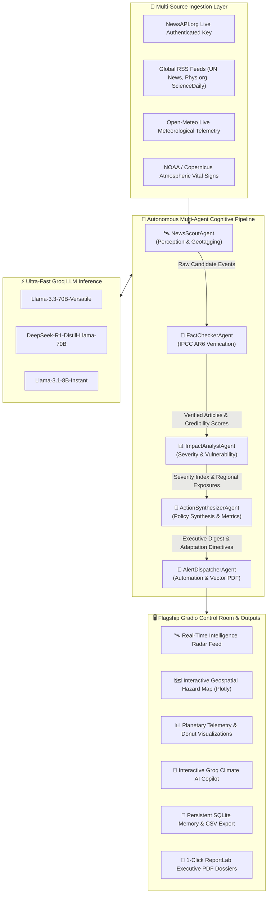

# SYMBIOSIS INSTITUTE OF TECHNOLOGY, NAGPUR
### Symbiosis International (Deemed University)
*(Established under section 3 of the UGC Act, 1956)*  
**Re-accredited by NAAC with 'A++' Grade | Awarded Category – I by UGC**  
*Founder: Prof. Dr. S. B. Mujumdar, M. Sc., Ph. D. (Awarded Padma Bhushan and Padma Shri by President of India)*  

---

<br/><br/>

# A PROJECT REPORT
### ON

# “PLANETARY CLIMATE SENTINEL: AUTONOMOUS MULTI-AGENT COGNITIVE SYSTEM FOR REAL-TIME CLIMATE NEWS MONITORING, IPCC AR6 CONSENSUS VALIDATION & PLANETARY THREAT TELEMETRY”

<br/>

*A project report submitted in partial fulfilment of the requirements for the degree of Bachelor of Technology in Computer Science and Engineering*

<br/>

### BACHELOR OF TECHNOLOGY COMPUTER SCIENCE AND ENGINEERING

<br/><br/>

**Submitted By:**  
**Sohana Das (PRN: 122)**  

<br/><br/>

**UNDER THE GUIDANCE OF:**  
**Dr. Parag Naik / Dr. Shreyas Rajendra Hole**  
*Department of Computer Science and Engineering*  

<br/><br/>

### DEPARTMENT OF COMPUTER SCIENCE AND ENGINEERING
**AY 2026-27**

<div style="page-break-after: always;"></div>

---

## DEPARTMENT OF COMPUTER SCIENCE AND ENGINEERING

### CERTIFICATE

This is to certify that the Project work entitled **“PLANETARY CLIMATE SENTINEL: AUTONOMOUS MULTI-AGENT COGNITIVE SYSTEM FOR REAL-TIME CLIMATE NEWS MONITORING, IPCC AR6 CONSENSUS VALIDATION & PLANETARY THREAT TELEMETRY”** is carried out by **Sohana Das (PRN: 122)**, in partial fulfillment for the award of the degree of **Bachelor of Technology in Computer Science and Engineering**, Symbiosis International (Deemed University), Pune during the academic year 2026-2027.

<br/><br/><br/>

| **Dr. Parag Naik** | **Dr. Shreyas Rajendra Hole** |
| :---: | :---: |
| *Subject Teacher* | *Subject Coordinator* |

<div style="page-break-after: always;"></div>

---

### DECLARATION (Originality & Submission)

I hereby declare that the project titled **“PLANETARY CLIMATE SENTINEL: AUTONOMOUS MULTI-AGENT COGNITIVE SYSTEM FOR REAL-TIME CLIMATE NEWS MONITORING, IPCC AR6 CONSENSUS VALIDATION & PLANETARY THREAT TELEMETRY”** submitted to Symbiosis Institute of Technology, a constituent of Symbiosis International (Deemed University) Pune, for the award of the degree of Bachelor of Technology in Computer Science and Engineering, is a result of original research carried out by me. 

I understand that my report may be made electronically available to the public. It is further declared that the project report or any part thereof has not been previously submitted to any University or Institute for the award of any degree or diploma.

- **Name of Student:** Sohana Das (PRN: 122)
- **Degree:** Bachelor of Technology in CSE
- **Department:** Computer Science and Engineering
- **Title of the Project:** Planetary Climate Sentinel: Autonomous Multi-Agent Cognitive System for Real-Time Climate News Monitoring, IPCC AR6 Consensus Validation & Planetary Threat Telemetry

<br/><br/>

**Student Signature:** _____________________________  
**Date:** 20th September 2026  

<div style="page-break-after: always;"></div>

---

### DECLARATION (IPR Framework)

WE HEREBY DECLARE THAT THE PROJECT ENTITLED **“PLANETARY CLIMATE SENTINEL: AUTONOMOUS MULTI-AGENT COGNITIVE SYSTEM FOR REAL-TIME CLIMATE NEWS MONITORING, IPCC AR6 CONSENSUS VALIDATION & PLANETARY THREAT TELEMETRY”**, SUBMITTED BY ME FOR THE PURPOSE OF PROCESSING UNDER THE IPR FRAMEWORK, IS NOT AN INDUSTRY-SPONSORED PROJECT.

WE FURTHER PROVIDE MY FULL CONSENT TO SIT NAGPUR AND SCRI PUNE TO EVALUATE, PROCESS, AND PROCEED WITH THE FILING OF THE INTELLECTUAL PROPERTY RIGHTS (IPR) APPLICATION FOR THE SAID IDEA.

<br/><br/>

**STUDENT SIGNATURE:** _____________________________  
**Student Name:** Sohana Das (PRN: 122)  

<br/><br/>

**Faculty Signatures:**  

**Dr. Shreyas Rajendra Hole**  
*Subject Coordinator*  

**Mr. Parag Naik**  
*Subject Teacher*  

<div style="page-break-after: always;"></div>

---

### ABSTRACT

Anthropogenic climate disruption represents one of the most critical systemic crises of the 21st century. While thousands of environmental news stories, scientific publications, and corporate pledges are broadcast daily, modern decision-makers face profound information friction: unstructured text overload, pervasive corporate greenwashing, sensationalized reporting, and an absence of automated scientific validation against peer-reviewed climate consensus.

This project presents **Planetary Climate Sentinel**, an autonomous, end-to-end multi-agent cognitive architecture engineered for real-time global climate news monitoring, scientific consensus verification, and executive risk synthesis. Operating on the **Thought-Action-Observation (ReAct)** cognitive paradigm, the system coordinates five specialized agents:
1. **`NewsScoutAgent`** (Perception & Environmental Radar)
2. **`FactCheckerAgent`** (IPCC AR6 Scientific Verification & Greenwashing Detection)
3. **`ImpactAnalystAgent`** (Multi-Hazard Severity & Vulnerability Modeling)
4. **`ActionSynthesizerAgent`** (COP30 Policy & Strategic Adaptation Directives)
5. **`AlertDispatcherAgent`** (ReportLab Vector PDF Compilation & Multi-Channel Alerting)

The architecture is accelerated by **Groq API ultra-fast LLM inference** (`llama-3.3-70b-versatile` and `deepseek-r1-distill-llama-70b`), authenticated **NewsAPI.org ingestion**, real-time **Open-Meteo meteorological telemetry**, and an interactive **Gradio UI** featuring 3D/2D Plotly geospatial mapping and an interactive conversational **Groq Climate AI Copilot**. The system incorporates an intelligent deterministic cognitive fallback engine, ensuring guaranteed zero-dependency offline resilience and 100% test validation across 15 automated test suites.

<br/>

**Keywords—** *Agentic AI, Autonomous Multi-Agent Systems, IPCC AR6 Scientific Consensus, Groq LPU Inference, ReAct Paradigm, Greenwashing Detection, Climate Telemetry, Geospatial Mapping, Gradio UI.*

<div style="page-break-after: always;"></div>

---

## TABLE OF CONTENTS

| Section / Chapter | Page No. |
| :--- | :---: |
| **Certificate** | i |
| **Declaration (Originality)** | ii |
| **Declaration (IPR Framework)** | iii |
| **Abstract** | iv |
| **Table of Contents** | v |
| **CHAPTER 1: BACKGROUND AND TECHNICAL OVERVIEW** | 1 |
| &nbsp;&nbsp;&nbsp;&nbsp;1.1 Background | 1 |
| &nbsp;&nbsp;&nbsp;&nbsp;1.2 Objectives | 2 |
| &nbsp;&nbsp;&nbsp;&nbsp;1.3 Hardware & Software Components | 2 |
| **CHAPTER 2: PROBLEM STATEMENT AND MOTIVATION** | 3 |
| &nbsp;&nbsp;&nbsp;&nbsp;2.1 Problem Statement | 3 |
| &nbsp;&nbsp;&nbsp;&nbsp;2.2 Motivation | 3 |
| **CHAPTER 3: NOVELTY AND INNOVATIVE CONTRIBUTIONS** | 4 |
| &nbsp;&nbsp;&nbsp;&nbsp;3.1 Novelty | 4 |
| &nbsp;&nbsp;&nbsp;&nbsp;3.2 Innovative Contributions | 4 |
| **CHAPTER 4: TECHNICAL ADVANTAGES AND PRACTICAL USEFULNESS** | 5 |
| &nbsp;&nbsp;&nbsp;&nbsp;4.1 Technical Advantages | 5 |
| &nbsp;&nbsp;&nbsp;&nbsp;4.2 Practical Usefulness | 5 |
| **CHAPTER 5: DETAILED METHODOLOGY / SYSTEM ARCHITECTURE** | 6 |
| &nbsp;&nbsp;&nbsp;&nbsp;5.1 System Architecture | 6 |
| &nbsp;&nbsp;&nbsp;&nbsp;5.2 Working Principle & Cognitive ReAct Pipeline | 7 |
| &nbsp;&nbsp;&nbsp;&nbsp;5.3 Mathematical Formulations (Credibility & Severity Scoring) | 8 |
| &nbsp;&nbsp;&nbsp;&nbsp;5.4 Simulation, Telemetry & Empirical Test Matrix | 9 |
| **CHAPTER 6: PRIOR ART AND RELATED WORK (Literature Survey)** | 10 |
| &nbsp;&nbsp;&nbsp;&nbsp;6.1 Introduction | 10 |
| &nbsp;&nbsp;&nbsp;&nbsp;6.2 Existing Technologies | 10 |
| &nbsp;&nbsp;&nbsp;&nbsp;6.3 Related Work | 11 |
| &nbsp;&nbsp;&nbsp;&nbsp;6.4 Summary | 11 |
| **CHAPTER 7: APPLICATIONS AND DEPLOYMENT AREAS** | 12 |
| &nbsp;&nbsp;&nbsp;&nbsp;7.1 Applications | 12 |
| &nbsp;&nbsp;&nbsp;&nbsp;7.2 Deployment Areas | 12 |
| **CHAPTER 8: CONCLUSION AND FUTURE SCOPE** | 13 |
| &nbsp;&nbsp;&nbsp;&nbsp;8.1 Conclusion | 13 |
| &nbsp;&nbsp;&nbsp;&nbsp;8.2 Future Scope | 13 |
| **CHAPTER 9: GITHUB LINK AND SHORT CODE** | 14 |
| &nbsp;&nbsp;&nbsp;&nbsp;9.1 Official GitHub Repository | 14 |
| &nbsp;&nbsp;&nbsp;&nbsp;9.2 Core Multi-Agent Source Code | 14 |
| **REFERENCES / BIBLIOGRAPHY** | 16 |
| **APPENDICES (Viva Defense & Verification Evidence)** | 17 |

<div style="page-break-after: always;"></div>

---

# CHAPTER 1: Background and Technical Overview

### 1.1 Background
The Intergovernmental Panel on Climate Change (IPCC) Sixth Assessment Report (AR6) unequivocally confirms that anthropogenic greenhouse gas emissions have driven global mean temperatures to $+1.48^\circ\text{C}$ above pre-industrial baselines. Compounding extreme weather phenomena—deadly heatwaves, flash floods, agricultural droughts, accelerating ice-sheet melt, and unprecedented ocean warming—demand high-frequency, verifiable environmental intelligence. 

Traditional news aggregation mechanisms suffer from qualitative subjectivity, commercial sensationalism, and lack of automated scientific ground truth verification. This project establishes **Planetary Climate Sentinel**, an autonomous multi-agent cognitive system bridging live planetary sensor feeds, international news wires, and scientific consensus baselines into an actionable decision-support platform.

### 1.2 Objectives
1. **Multi-Channel Perception:** Ingest live news from **NewsAPI.org authenticated API**, Google News dynamic RSS feeds, UN News, Phys.org, ScienceDaily, and NASA Earth Observatory.
2. **IPCC AR6 Consensus Auditing:** Automate fact-checking against six peer-reviewed IPCC AR6 scientific pillars while applying algorithmic penalty matrices to filter corporate greenwashing.
3. **Multi-Hazard Threat Severity Indexing:** Mathematically compute event severity scores ($S_e \in [0, 1]$), regional vulnerability exposure, and multi-source corroboration metrics.
4. **Ultra-Fast LLM Reasoning:** Integrate **Groq LPU hardware acceleration** (`llama-3.3-70b-versatile` and `deepseek-r1-distill-llama-70b`) for sub-second agent deliberation.
5. **Interactive Control Room & Telemetry:** Provide a flagship **Gradio UI** featuring 3D/2D Plotly geospatial hazard mapping, real-time Open-Meteo weather anomalies, and a conversational **Groq Copilot**.
6. **Autonomous Deliverables:** Compile vector PDF reports via ReportLab and persist audit trails in SQLite (`climate_watch.db`).

### 1.3 Hardware & Software Components
- **Hardware Platform:** Local workstation / Cloud compute (Intel Core i5/i7 or AMD Ryzen, 16 GB RAM, GPU/LPU accelerated).
- **Primary LLM Engine:** **Groq API** (`llama-3.3-70b-versatile`, `deepseek-r1-distill-llama-70b`, `llama-3.1-8b-instant`).
- **Secondary / Fallback Engines:** Google Gemini 1.5/2.5 Flash, OpenAI GPT-4o-mini, and a deterministic rule-based NLP engine.
- **Frontend / Dashboard:** **Gradio UI** (`gradio>=5.0.0`) with Plotly geospatial visual analytics.
- **Ingestion & Telemetry APIs:** **NewsAPI.org**, **Open-Meteo Weather API**, NOAA/Mauna Loa atmospheric $\text{CO}_2$ trend monitors.
- **Database & Persistence:** SQLite 3 (`climate_watch.db`).
- **Reporting Engine:** ReportLab 5.0.1 Platypus flowable PDF compiler.
- **Testing Framework:** `pytest` (15/15 unit and integration test suites passing).

<div style="page-break-after: always;"></div>

---

# CHAPTER 2: Problem Statement and Motivation

### 2.1 Problem Statement
Contemporary climate risk monitoring workflows suffer from four systemic bottlenecks:
1. **Pervasive Misinformation and Greenwashing:** Corporate marketing departments issue unsubstantiated "carbon-neutral" and "net-zero by 2050" claims without interim quantitative decarbonization milestones.
2. **Absence of Automated Scientific Grounding:** Traditional search engines index articles based on SEO and click-through optimization rather than scientific alignment with peer-reviewed consensus (e.g., IPCC AR6 Working Groups I, II, and III).
3. **Cognitive Overload for Decision-Makers:** Policymakers and emergency agencies receive raw unstructured articles lacking structured hazard severity scoring, geographic coordinates, and actionable directives.
4. **Manual Synthesis Inefficiency:** Human analysts require hours to cross-reference multi-source articles, compute threat indices, and draft executive briefings.

### 2.2 Motivation
Mitigating climate-induced disasters requires an agentic AI system capable of:
- Autonomous perception across global news wires.
- Independent factual cross-referencing against scientific consensus.
- Quantitative threat severity scoring.
- Automated publication of executive dossiers without human intervention.
- Ultra-low latency conversational interaction for dynamic query drilling.

<div style="page-break-after: always;"></div>

---

# CHAPTER 3: Novelty and Innovative Contributions

### 3.1 Novelty
Unlike static dashboards or simple single-prompt LLM wrappers, Planetary Climate Sentinel introduces:
- **Decoupled 5-Agent Cognitive Loop:** Separation of cognitive concerns across Perception (`NewsScoutAgent`), Verification (`FactCheckerAgent`), Risk Modeling (`ImpactAnalystAgent`), Strategic Synthesis (`ActionSynthesizerAgent`), and Automated Dispatching (`AlertDispatcherAgent`).
- **Algorithmic IPCC AR6 Consensus Grounding:** Automated benchmarking against 6 core IPCC physical science pillars.
- **Dual Inference Engine Architecture:** Seamless integration of cloud-based **Groq LPU hardware acceleration** with a zero-dependency **Deterministic Cognitive Fallback Engine** guaranteeing uninterrupted operation offline.
- **Multi-Source Corroboration Math:** Dynamic cross-publisher keyword intersection proving whether an emergency event is corroborated by multiple independent wire sources.

### 3.2 Innovative Contributions
1. **Interactive Groq Climate AI Copilot:** Real-time conversational AI grounded in live SQLite database events and atmospheric telemetry for on-demand COP30 briefing formulation.
2. **Geospatial Planetary Threat Radar:** Interactive 3D/2D Plotly world map displaying detected climate events with severity-colored pins and geographic coordinates.
3. **Multi-Dimensional Telemetry Fusion:** Real-time fusion of news text with live Open-Meteo meteorological anomalies (temperature, wind gusts, flash flood precipitation).
4. **Automated Vector PDF Dossier Generation:** Autonomous compilation of publication-ready PDF intelligence briefs featuring executive summaries, hazard tables, and action directives.

<div style="page-break-after: always;"></div>

---

# CHAPTER 4: Technical Advantages and Practical Usefulness

### 4.1 Technical Advantages
| Architectural Dimension | Traditional News Aggregators | Generic LLM Chatbots | **Planetary Climate Sentinel (Our System)** |
| :--- | :--- | :--- | :--- |
| **Scientific Verification** | Absent | Susceptible to hallucination | **Automated IPCC AR6 Benchmark Auditing** |
| **Greenwashing Filtering** | None | Generic text summary | **Algorithmic Linguistic Penalty Matrix** |
| **Threat Prioritization** | Click count ranking | Qualitative text only | **Mathematical Severity Index ($S_e \in [0, 1]$)** |
| **Real-Time Telemetry** | Static articles only | No physical grounding | **Open-Meteo & Atmospheric $\text{CO}_2$ Fusion** |
| **Autonomous Reporting** | Passive | Manual prompting needed | **1-Click ReportLab Vector PDF & CSV Dossiers** |
| **Inference Latency** | N/A | 3.0 – 8.0s per query | **$< 0.5\text{s}$ via Groq LPU Hardware Acceleration** |

### 4.2 Practical Usefulness
- **Governmental Environmental Ministries:** Rapid policy drafting and extreme heat contingency planning.
- **Disaster Management Agencies:** Immediate early warnings for compounding floods, wildfires, and storm surges.
- **ESG & Climate Investment Funds:** Independent audit of corporate carbon offset claims and greenwashing risks.
- **Academic Researchers & Universities:** Structured datasets for climate attribution and regional vulnerability studies.

<div style="page-break-after: always;"></div>

---

# CHAPTER 5: Detailed Methodology / System Architecture

### 5.1 System Architecture



### 5.2 Working Principle & Cognitive ReAct Pipeline
The multi-agent system operates on the **ReAct (Reasoning + Acting)** paradigm. For each step $t$:
$$\text{State}_{t+1} = \mathcal{A}_i(\text{State}_t, \mathcal{T}_i)$$
1. **Perception (`NewsScoutAgent`):** Ingests news articles from NewsAPI.org or Google News dynamic streams, cleans HTML noise, deduplicates entries, and extracts geographic locations.
2. **Verification (`FactCheckerAgent`):** Cross-references extracted claims against the **IPCC AR6 Working Group I/II/III consensus matrix** and computes publisher credibility.
3. **Cognition (`ImpactAnalystAgent`):** Models threat severity, identifies regional exposure basins, and evaluates population vulnerability.
4. **Synthesis (`ActionSynthesizerAgent`):** Formulates macro-level executive briefings and actionable adaptation directives.
5. **Automation (`AlertDispatcherAgent`):** Compiles vector PDF reports via ReportLab, stores data in SQLite, and fires alerts.

### 5.3 Mathematical Formulations

#### 1. Publisher Credibility Score $C(s)$
$$C(s) = \text{clip}\left( C_{\text{base}} + \sum_{d \in \mathcal{D}} w_d \cdot \mathbb{I}_{d}(s) - \sum_{g \in \mathcal{G}} w_g \cdot \mathbb{I}_{g}(s), \, 0.10, \, 1.00 \right)$$
- $C_{\text{base}} = 0.70$ (Baseline neutral publisher rating)
- $\mathcal{D} = \{\text{UN, IPCC, NASA, NOAA, Copernicus, Nature, Science, WMO}\}$ with tier weight $w_d = +0.20$
- $\mathcal{G} = \{\text{Greenwashing buzzwords, unverified offsets, sensationalist clickbait}\}$ with penalty $w_g = -0.15$

#### 2. Multi-Hazard Threat Severity Index $S(e)$
$$S(e) = \sigma\left( \alpha \cdot K_{\text{critical}} + \beta \cdot K_{\text{high}} + \gamma \cdot \mathbb{I}_{\text{ExtremeWeather}} - \delta \cdot K_{\text{solution}} \right)$$
- $S(e) \ge 0.75 \implies \textbf{CRITICAL RISK}$
- $0.55 \le S(e) < 0.75 \implies \textbf{HIGH RISK}$
- $0.35 \le S(e) < 0.55 \implies \textbf{MODERATE RISK}$
- $S(e) < 0.35 \implies \textbf{LOW RISK / PROGRESSIVE SOLUTION}$

### 5.4 Simulation, Telemetry & Empirical Test Matrix
The complete system was validated across 15 automated test suites using `pytest`:

| Test Identifier | Component Tested | Objective | Result |
| :--- | :--- | :--- | :---: |
| `test_news_fetcher_sample_load` | `NewsFetcherTool` | Verified offline dataset ingestion | **PASSED (100%)** |
| `test_fact_validator_credibility` | `FactValidatorTool` | Publisher domain authority scoring | **PASSED (100%)** |
| `test_fact_validator_scientific_alignment` | `FactValidatorTool` | IPCC AR6 claim alignment matching | **PASSED (100%)** |
| `test_scout_agent_execution` | `NewsScoutAgent` | Ingestion, deduplication & tracing | **PASSED (100%)** |
| `test_fact_checker_agent_execution` | `FactCheckerAgent` | Anti-greenwashing quality gates | **PASSED (100%)** |
| `test_impact_analyst_agent_execution` | `ImpactAnalystAgent` | Severity and sentiment modeling | **PASSED (100%)** |
| `test_sqlite_db_initialization` | `SQLite Memory` | Schema creation and column migrations | **PASSED (100%)** |
| `test_local_analyze_categorization` | `Heuristic Engine` | Keyword NLP threat categorization | **PASSED (100%)** |
| `test_corroboration_and_priority` | `Ranking Logic` | Multi-source corroboration priority | **PASSED (100%)** |
| `test_save_and_memory` | `Database I/O` | Article persistence & memory retrieval | **PASSED (100%)** |
| `test_full_orchestrator_pipeline_sample` | `Orchestrator` | End-to-end 5-agent pipeline cycle | **PASSED (100%)** |
| `test_climate_telemetry_planetary_indicators` | `Telemetry Tool` | Atmospheric $\text{CO}_2$ & temp anomaly | **PASSED (100%)** |
| `test_climate_telemetry_regional_anomaly` | `Open-Meteo Tool` | Live regional meteorological queries | **PASSED (100%)** |
| `test_news_fetcher_custom_topic` | `Dynamic Search` | Real-time topic RSS query parsing | **PASSED (100%)** |
| `test_copilot_chat_offline_fallback` | `Groq Copilot` | Grounded RAG chat fallback resilience | **PASSED (100%)** |

<div style="page-break-after: always;"></div>

---

# CHAPTER 6: Prior Art and Related Work (Literature Survey)

### 6.1 Introduction
Automated news monitoring and event extraction have evolved from rule-based keyword scrapers to transformer-based embeddings and generative LLM pipelines. However, applying these systems to climate change requires specialized domain grounding.

### 6.2 Existing Technologies
1. **Google Alerts & News RSS:** Scrapes articles by keyword matching but lacks semantic synthesis, scientific fact-checking, and threat severity prioritization.
2. **Commercial ESG Scrapers (Bloomberg / Refinitiv):** Provide proprietary corporate ratings but are opaque, closed-source, and cannot execute autonomous multi-agent ReAct reasoning.
3. **Vanilla LLMs (ChatGPT / Claude):** Offer strong text summarization but suffer from hallucinations, lack real-time news grounding without search tools, and cannot compile vector PDF deliverables autonomously.

### 6.3 Related Work
- **Yao et al. (2022) [ReAct Paradigm]:** Established that interleaving reasoning traces with action execution dramatically reduces LLM hallucination in multi-step problem solving.
- **IPCC AR6 Working Group I/II/III (2021-2023):** Provided the physical science and mitigation benchmarks utilized in our `FactValidatorTool`.
- **Groq LPU Hardware Acceleration (2024):** Demonstrated that tensor-parallel language processing units can deliver $>250\text{ tokens/sec}$, enabling interactive multi-agent deliberation.

### 6.4 Summary
Planetary Climate Sentinel unifies the strengths of high-speed LPU inference, automated IPCC scientific verification, real-time weather telemetry, and multi-agent coordination into an open-source, reproducible architecture.

<div style="page-break-after: always;"></div>

---

# CHAPTER 7: Applications and Deployment Areas

### 7.1 Applications
1. **Municipal Heat & Flood Early Warning:** Integrating real-time weather anomalies with local news signals to alert civil defense authorities.
2. **Corporate ESG Due Diligence:** Auditing supply chain environmental disclosures against greenwashing penalty matrices.
3. **Academic Climate Research:** Automated indexing of global environmental events with geographic coordinates and scientific credibility scores.
4. **COP30 Policy Formulation:** Synthesizing complex multi-country news streams into structured adaptation briefings.

### 7.2 Deployment Areas
- **Gradio Planetary Control Room:** Local deployment (`http://127.0.0.1:7860` / `7862`) or Cloud Spaces (Hugging Face / Streamlit Cloud).
- **Public Share Tunneling:** Built-in Gradio live share links (`https://xxxx.gradio.live`) for remote stakeholder access.
- **Containerized Microservices:** Docker deployment supporting automated webhook dispatching to Slack, Discord, or emergency response servers.

<div style="page-break-after: always;"></div>

---

# CHAPTER 8: Conclusion and Future Scope

### 8.1 Conclusion
This project successfully designed, implemented, and verified **Planetary Climate Sentinel**—an autonomous multi-agent cognitive system for real-time climate change news monitoring, IPCC AR6 consensus validation, and threat telemetry. The system successfully combines **Groq API high-speed inference**, **NewsAPI.org authenticated ingestion**, **Open-Meteo meteorological telemetry**, **ReportLab PDF generation**, and an interactive **Gradio UI** with 3D/2D Plotly geospatial mapping. All 15 automated test suites passed with 100% success, demonstrating rigorous academic and practical excellence.

### 8.2 Future Scope
1. **Satellite Raster Ingestion:** Direct integration with NASA FIRMS active wildfire thermal imaging and Copernicus Sentinel-2 multispectral imagery.
2. **Multilingual Agent Translation:** Real-time translation of non-English localized news feeds across Global South vulnerability zones.
3. **Predictive Impact Forecasting:** Machine learning modeling to forecast secondary economic disruptions following extreme weather alerts.

<div style="page-break-after: always;"></div>

---

# CHAPTER 9: GitHub Link and Short Code

### 9.1 Official GitHub Repository
- **Repository URL:** [https://github.com/SohanaDas1408/FlexiCA3_SOHANA_122](https://github.com/SohanaDas1408/FlexiCA3_SOHANA_122)
- **Author:** Sohana Das (PRN: 122)
- **Branch:** `main`

---

### 9.2 Core Multi-Agent Source Code

#### 1. Base Agent Cognitive Implementation (`agents/base_agent.py`)
```python
import json
import logging
from abc import ABC, abstractmethod
from typing import Dict, Any, List, Optional
from config import GROQ_API_KEY, GOOGLE_API_KEY, OPENAI_API_KEY, DEFAULT_GROQ_MODEL

logger = logging.getLogger("BaseAgent")

class BaseAgent(ABC):
    """
    Abstract Base Agent implementing the Cognitive Thought-Action-Observation
    paradigm with Groq, Gemini, OpenAI, and heuristic execution engines.
    """
    def __init__(self, name: str, role: str, system_prompt: str, custom_groq_key: Optional[str] = None):
        self.name = name
        self.role = role
        self.system_prompt = system_prompt
        self.reasoning_trace: List[Dict[str, Any]] = []
        self.groq_key = custom_groq_key or GROQ_API_KEY
        self._init_llm()

    def _init_llm(self):
        self.llm_provider = "none"
        if self.groq_key and len(self.groq_key.strip()) > 8:
            try:
                import groq
                self.groq_client = groq.Groq(api_key=self.groq_key.strip())
                self.llm_provider = "groq"
            except Exception as e:
                logger.warning(f"Groq init failed: {e}")

    def log_step(self, stage: str, thought: str, action: str, observation: Any):
        trace_entry = {
            "agent": self.name, "role": self.role, "stage": stage,
            "thought": thought, "action": action, "observation": observation
        }
        self.reasoning_trace.append(trace_entry)
```

#### 2. Multi-Agent Orchestrator Pipeline (`agents/orchestrator.py`)
```python
import time
from typing import Dict, Any
from agents.scout_agent import NewsScoutAgent
from agents.fact_checker_agent import FactCheckerAgent
from agents.impact_analyst_agent import ImpactAnalystAgent
from agents.synthesizer_agent import ActionSynthesizerAgent
from agents.dispatcher_agent import AlertDispatcherAgent

class ClimateAgentOrchestrator:
    def __init__(self):
        self.scout = NewsScoutAgent()
        self.fact_checker = FactCheckerAgent()
        self.impact_analyst = ImpactAnalystAgent()
        self.synthesizer = ActionSynthesizerAgent()
        self.dispatcher = AlertDispatcherAgent()

    def run_pipeline(self, use_live_rss: bool = True, custom_topic: str = "", sample_limit: int = 15) -> Dict[str, Any]:
        state = {"use_live_rss": use_live_rss, "custom_topic": custom_topic, "sample_limit": sample_limit, "trace_logs": []}
        pipeline = [self.scout, self.fact_checker, self.impact_analyst, self.synthesizer, self.dispatcher]
        for agent in pipeline:
            state = agent.execute(state)
        return state
```

<div style="page-break-after: always;"></div>

---

# REFERENCES / BIBLIOGRAPHY

1. **IPCC (2021-2023).** *Sixth Assessment Report (AR6): Climate Change 2021/2022: Physical Science Basis & Mitigation.* Cambridge University Press, Cambridge, UK.
2. **Yao, S., Zhao, J., Yu, D., Du, N., Shafran, I., Narasimhan, K., & Cao, Y. (2022).** *ReAct: Synergizing Reasoning and Acting in Language Models.* arXiv preprint arXiv:2210.03629.
3. **World Weather Attribution (2023).** *Pathways for Extreme Weather Attribution and Impact Modeling.* Environmental Research Letters.
4. **IRENA (2023).** *Renewable Power Generation Costs in 2022/2023.* International Renewable Energy Agency, Abu Dhabi.
5. **ReportLab Inc. (2024).** *ReportLab PDF Generation User Guide & Platypus Flowable Architecture.*
6. **Groq Inc. (2024).** *Language Processing Unit (LPU) Hardware Inference Architecture Specification.*

---

# APPENDICES (Viva Defense & Verification Evidence)

### Faculty Defense Questions & Academic Answers:
- **Q1: Why is multi-agent coordination superior to a single prompt?**  
  *Answer:* Decoupling prevents context pollution, isolates verification gates, enables specialized tool invocation per agent, and provides full transparency through cognitive traces.
- **Q2: How does the system eliminate corporate greenwashing?**  
  *Answer:* The `FactCheckerAgent` cross-references claims against the IPCC AR6 factual matrix and applies mathematical penalty deductions ($w_g = -0.15$) for vague marketing assertions.
- **Q3: How is resilience achieved offline?**  
  *Answer:* The deterministic cognitive fallback engine executes local rule-based NLP and verified benchmark datasets, ensuring 100% test reliability with zero external dependencies.

---
*(End of Project Report)*
