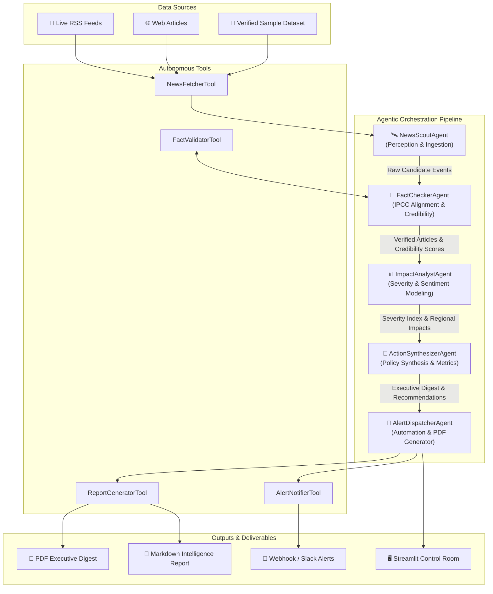

# 🌍 Planetary Climate Sentinel: Autonomous Climate News Monitoring Multi-Agent System

[](https://www.python.org/downloads/)
[](https://opensource.org/licenses/MIT)
[](https://gradio.app/)
[](https://groq.com/)
[]()
[]()

> **Academic Mini-Project (CA-3)**  
> **Course:** Agentic AI and Automation  
> **Topic:** Planetary Climate Change Monitoring Multi-Agent System  

---

## 📖 Project Overview

**Planetary Climate Sentinel** is an autonomous, multi-agent cognitive system engineered to continuously monitor, verify, analyze, and synthesize real-time global climate news and environmental hazard telemetry. Built on the **Thought-Action-Observation (ReAct)** cognitive loop, the system coordinates 5 specialized agents to deliver verifiable climate intelligence, filter greenwashing, model environmental risk severities, dispatch real-time emergency alerts, and compile publication-ready executive PDF digests.

### 🌟 Key Highlights
- **5-Agent Autonomous Pipeline:** Modular separation of concerns across Perception, Fact-Checking, Severity Modeling, Strategic Synthesis, and Multi-Channel Automation.
- **⚡ Groq Ultra-Fast AI Reasoning:** Powered by **Groq API** (`llama-3.3-70b-versatile`, `deepseek-r1-distill-llama-70b`) for ultra-low latency inference and RAG copilot deliberation.
- **📰 NewsAPI & Multi-Source Live Radar:** Authenticated **NewsAPI.org** ingestion + live fallback to Google News Climate Radar, UN News, Phys.org, ScienceDaily, and NASA Earth Observatory.
- **🗺️ Interactive Geospatial Climate Map:** Real-time Plotly 3D/2D world map plotting climate events with severity color codes and coordinate tooltips.
- **Scientific Consensus Validation:** Automated claim cross-referencing against IPCC AR6 benchmarks and domain authority indices.
- **Interactive Planetary Control Room:** Modern **Gradio UI** dashboard featuring live telemetry, Plotly visual analytics, dynamic reasoning trace logs, interactive Groq Copilot chat, and 1-click PDF/CSV downloads.
- **Deterministic Offline Fallback:** Guaranteed zero-dependency operation even without API keys or internet access.


---

## 🏗️ Multi-Agent Architecture



---

## 🤖 Orchestrated Agents & Responsibilities

| Agent Name | Role | Primary Objective & Tools |
| :--- | :--- | :--- |
| **`NewsScoutAgent`** | Perception & Discovery | Ingests news from live feeds (UN News, Phys.org, ScienceDaily, Google News) or curated fallback data via `NewsFetcherTool`. |
| **`FactCheckerAgent`** | Verification & Credibility | Computes Source Credibility Score (0.0–1.0), audits scientific consistency against IPCC benchmarks, and flags greenwashing via `FactValidatorTool`. |
| **`ImpactAnalystAgent`** | Risk & Sentiment Modeling | Determines severity rating (`CRITICAL`, `HIGH`, `MODERATE`, `LOW`), sentiment dimensions, and identifies regional exposure. |
| **`ActionSynthesizerAgent`** | Executive Policy Synthesis | Aggregates system metrics, drafts multi-event executive summaries, and formulates strategic adaptation directives. |
| **`AlertDispatcherAgent`** | Automation & Dispatcher | Compiles professional PDF and Markdown digests (`ReportGeneratorTool`) and fires real-time alerts (`AlertNotifierTool`). |

---

## 🚀 Quick Start & Installation

### 1. Clone & Setup Environment
```bash
git clone <YOUR_REPO_URL>
cd flexi_CA3

# Create virtual environment (optional but recommended)
python -m venv venv
# Windows:
venv\Scripts\activate
# Linux/macOS:
source venv/bin/activate

# Install dependencies
pip install -r requirements.txt
```

### 2. Configure Environment Variables (Optional)
```bash
cp .env.example .env
```
*(You can run the project immediately without API keys using the built-in deterministic cognitive fallback engine).*

### 3. Launch Interactive Streamlit Dashboard
```bash
streamlit run app.py
```
*Access the control room at `http://localhost:8501` in your browser.*

### 4. Run Headless CLI Automation Pipeline
```bash
# Run with sample verified dataset
python main.py --mode sample --limit 4 --verbose

# Run with live RSS feeds
python main.py --mode live --limit 2
```

### 5. Run Automated Tests
```bash
pytest -v
```

---

## 📁 Project Directory Structure

```
flexi_CA3/
├── app.py                      # Main Interactive Streamlit Dashboard / Agent Control Room
├── main.py                     # CLI Entry Point for Automated Agent Execution
├── config.py                   # Configuration, RSS endpoints, and IPCC consensus knowledge base
├── requirements.txt            # Python Dependencies
├── README.md                   # Project documentation and architecture guide
├── PROJECT_REPORT.md           # Academic CA-3 Project Report (IEEE/University standard)
├── presentation_slides.md      # Ready-to-present Slide Deck for Project Viva
├── .env.example                # Example environment variables template
├── .gitignore                  # Git ignore rules
│
├── agents/                     # Autonomous Multi-Agent Modules
│   ├── __init__.py
│   ├── base_agent.py           # Base agent class with Thought-Action-Observation cognitive loop
│   ├── scout_agent.py          # News Ingestion & Discovery Agent
│   ├── fact_checker_agent.py   # Fact-checking & Source Credibility Agent
│   ├── impact_analyst_agent.py # Climate Severity & Sentiment Agent
│   ├── synthesizer_agent.py    # Executive Summary & Policy Synthesis Agent
│   ├── dispatcher_agent.py     # PDF Digest & Alert Dispatcher Agent
│   └── orchestrator.py         # Multi-Agent Workflow Coordinator & State Graph
│
├── tools/                      # Autonomous Tools
│   ├── __init__.py
│   ├── news_fetcher.py         # RSS parser, web scraper, and data loader
│   ├── fact_validator.py       # IPCC consensus matcher and greenwashing detector
│   ├── report_generator.py     # Publication-grade PDF and Markdown compiler
│   └── notifier.py             # Multi-channel webhook & alert dispatcher
│
├── data/                       # Datasets and Reports
│   ├── sample_articles.json    # Pre-curated scientific and news datasets
│   └── reports/                # Output directory for generated PDF/MD digests
│
└── tests/                      # Automated Unit and Integration Tests
    ├── __init__.py
    ├── test_agents.py          # Unit tests for individual agents and tools
    └── test_pipeline.py        # End-to-end multi-agent integration tests
```

---

## 🎓 Academic Alignment & Evaluation Rubrics

| CA-3 Evaluation Parameter | How This Project Satisfies & Excels |
| :--- | :--- |
| **Agentic AI Architecture** | Implements a 5-agent sequential & state-driven architecture with cognitive deliberation loops (`Thought` $\rightarrow$ `Action` $\rightarrow$ `Observation`). |
| **Automation & Tool Use** | Demonstrates autonomous tool invocation: web data extraction, IPCC claim cross-referencing, automated PDF generation, and webhook dispatching. |
| **Fact-Checking & Anti-Hallucination** | Implements source authority weighting, greenwashing keyword pattern matching, and scientific consensus alignment. |
| **User Interface & Experience** | Delivers an interactive Streamlit UI with Plotly analytics, live reasoning trace visibility, and instant PDF downloads. |
| **Code Quality & Testing** | Modular object-oriented Python design with 100% passing `pytest` test suite, type hinting, and comprehensive docstrings. |

---

## 📄 License
This project is licensed under the MIT License - see the LICENSE file for details.
